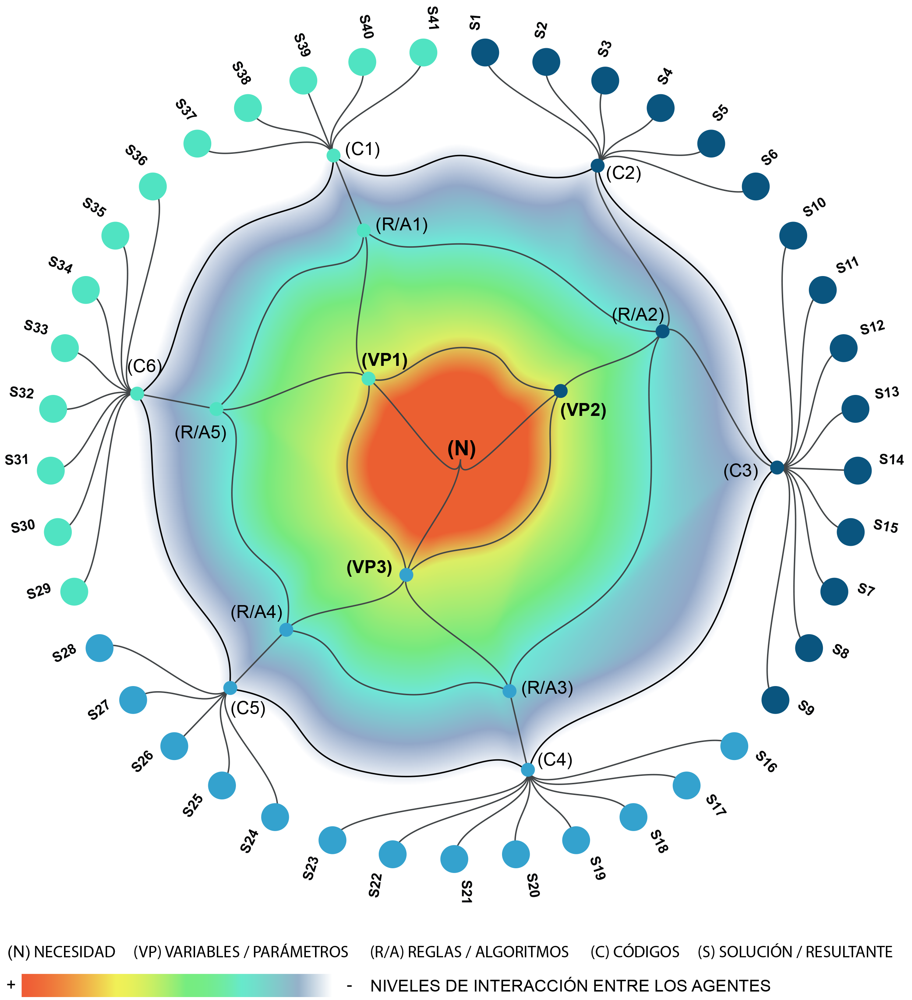

# Diseño paramétrico, conceptos y métodos aplicados
El presente proyecto de investigación tiene como objetivo principal la exploración de los conceptos y métodos aplicados en el diseño paramétrico. Se centra en comprender cómo la parametrización puede transformar y optimizar el proceso de diseño en diversas disciplinas, abordando sus fundamentos teóricos, evolución histórica y su relación con la tecnología digital.

---

## Productos

``Mancilla González, E. C., & Guerrero Salinas, M. (2024). Modelo teórico-metodológico de diseño paramétrico. Cuadernos Del Centro De Estudios De Diseño Y Comunicación, (228). https://doi.org/10.18682/cdc.vi228.11331``

``Guerrero, M. (2022). Sistemas Complejos Adaptativos en el diseño paramétrico. En Vázquez, G. (coord.) Diseño y Complejidad. Utopías, ideales y paradigmas. (pp. 53-80). Nuevo León, Méico: Labýrinthos, UANL, UASLP``

``Guerrero, M. Mancilla, E. C. (2020). Sonotipo: arte generativo a partir del sonido, en Rumbos atrevidos, pero necesarios. Conversación entre innovación, arte y creatividad Madrid: GKA Ediciones``

``Guerrero, M. (2015). La experimentación formal en el diseño tipográfico. Revista Diseño en Síntesis. Reflexiones sobre la cultura del diseño (53). UAM Xochimilco``

## Tesis

``Escobedo, J. G. (2025). Sistema de identidad paramétrica “Casa Fronda” [Tesis de licenciatura, Universidad Autónoma de San Luis Potosí]. San Luis Potosí, México``
